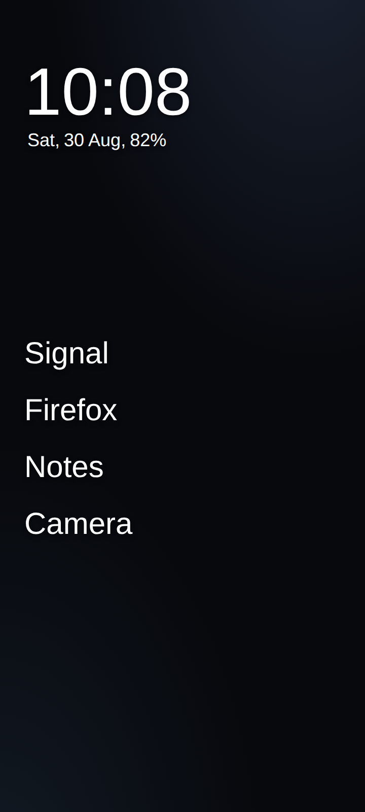
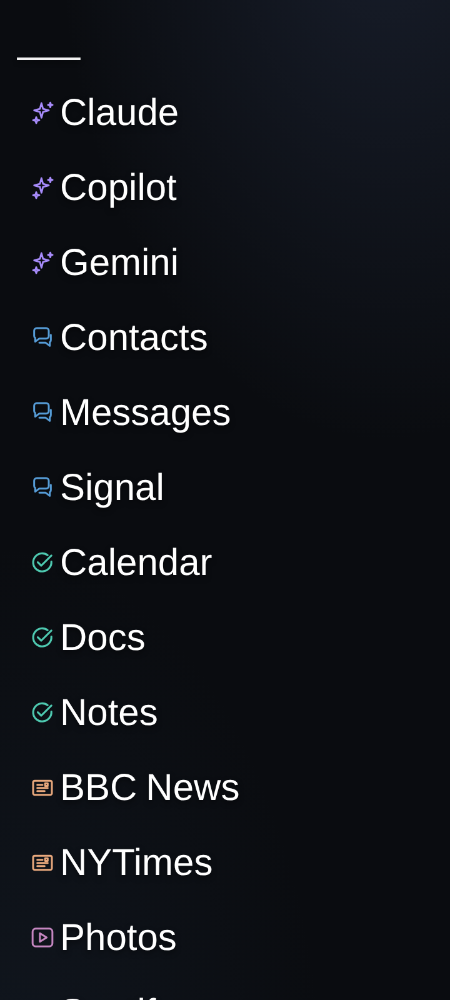
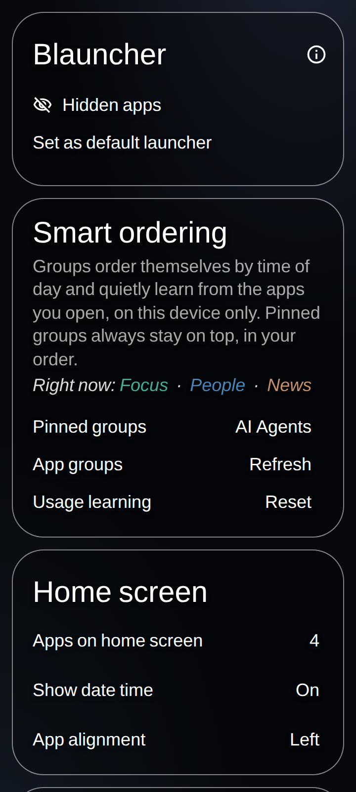

# Blauncher

Blauncher is a text-only, gesture-driven Android launcher: a black screen, a
clock, and the names of your apps. No icons, no dock, no widgets, no on-screen
buttons. It is a personal hard fork of
[Olauncher](https://github.com/tanujnotes/Olauncher), maintained as a focused,
private launcher rather than as an official Olauncher release.

New here? The launcher deliberately gives no visual hints — read the
**[user guide](GUIDE.md)** first. The short version: **swipe up** for apps,
**long-press the home screen** for settings.

## Screens

| Home | App drawer | Settings |
| :---: | :---: | :---: |
|  |  |  |

*These images are pixel renders built from the app's actual layouts, strings,
colors, and category glyphs (this repository has no emulator in CI), so minor
details may differ from a device screenshot.*

## What it does

- **A near-empty home screen.** A clock, the date with battery level, and up
  to eight apps of your choosing (four by default) as plain text. Everything
  else is a gesture: swipe up for the drawer, swipe down for notifications or
  search, swipe left/right for two apps of your choice, long-press for
  settings.
- **Keyboard-first app drawer.** The keyboard opens with the drawer; typing
  filters instantly, a single match launches itself, and enter launches the
  first match. No match? Enter hands the query to your search app; start with
  `!` to search DuckDuckGo instead. Start with a space to browse without
  auto-launch.
- **Apps organized into groups.** Every app is categorized on-device into
  groups such as AI Agents, People, Focus, News, Media, and Tools, each marked
  with a small colored glyph. Categorization is heuristic-based and local;
  long-press any app to correct its group, or put it in several groups at
  once (search still dedupes, so auto-launch stays correct).
- **Smart group ordering.** Group order follows the time of day — news in the
  early morning, focus apps during work hours, media in the evening — via
  smooth built-in weekday/weekend curves, then quietly sharpens as the
  launcher learns from the apps you actually open (bucketed by hour and day
  type, fading with a two-week half-life). Apps stay alphabetical inside every
  group. Any number of groups can be pinned to the top in an order you choose;
  **AI Agents is pinned first by default**. Learning can be reset in Settings.
- **Private, by construction.** The app requests **no internet permission**,
  never reads the system usage-stats API, keeps all data (including learned
  ordering weights) in local app preferences excluded from device backups,
  and has no account, sync, analytics, or launcher-managed wallpaper. Details
  in [`SECURITY.md`](SECURITY.md).
- **Private Space support** on devices that have it, with a tap-to-unlock row
  at the bottom of the drawer. There is no accessibility service.

## Latest-only platform policy

Blauncher intentionally tracks the **latest public stable Android release and
toolchain only** — currently Android 17 (API 37), with `minSdk`, `targetSdk`,
and `compileSdk` all set to 37 — and the current stable Android Gradle Plugin
and Gradle (pinned in [`gradle/libs.versions.toml`](gradle/libs.versions.toml)
and [`gradle/wrapper/gradle-wrapper.properties`](gradle/wrapper/gradle-wrapper.properties)).
There is no backwards compatibility: older Android versions are not supported,
and no compatibility shims or legacy code paths are kept around. This is a
deliberate trade for maximum security and freshness on a personal device. The
full policy lives in [`AGENTS.md`](AGENTS.md).

## Install

1. Download `Blauncher.apk` from the
   [latest release](https://github.com/bradflaugher/Blauncher/releases/tag/latest),
   optionally verifying it against the published `Blauncher.apk.sha256`
   checksum (see [`SECURITY.md`](SECURITY.md)).
2. Install it, open it, and tap **Set as default launcher**.
3. Requires the latest stable Android (currently Android 17, API 37).

## Build

Install JDK 17 and Android SDK Platform 37 (`platforms;android-37.0`), then:

```sh
./gradlew lint test assembleDebug
```

An unsigned release build:

```sh
./gradlew assembleRelease
```

Local builds default to version code `1` and version name `1.0`; automated
builds override them with `BLAUNCHER_VERSION_CODE` and
`BLAUNCHER_VERSION_NAME`:

```sh
BLAUNCHER_VERSION_CODE=42 BLAUNCHER_VERSION_NAME=1.0.42 ./gradlew assembleRelease
```

The application ID is `com.bradflaugher.blauncher`; the inherited source and
namespace remain under `app.olauncher`.

### Signed releases

Set all four signing variables before building a signed release:

```sh
export BLAUNCHER_KEYSTORE_PATH=/absolute/path/to/blauncher.jks
export BLAUNCHER_STORE_PASSWORD=store-password
export BLAUNCHER_KEY_ALIAS=key-alias
export BLAUNCHER_KEY_PASSWORD=key-password
./gradlew assembleRelease
```

Signing is all-or-nothing: with none of these set the release is unsigned,
and configuration fails when only some are set.

### Continuous integration

Every push to `main` runs lint, tests, and a signed release build in GitHub
Actions, then replaces the single `latest` release and its `Blauncher.apk`,
publishing a `Blauncher.apk.sha256` checksum alongside it. Pull requests run
the same checks and produce an unsigned APK without publishing a release.
CodeQL scans the Kotlin sources and the workflows on every push and weekly.

The release pipeline needs these repository secrets:

- `BLAUNCHER_KEYSTORE_BASE64` — the keystore encoded with base64
- `BLAUNCHER_STORE_PASSWORD`
- `BLAUNCHER_KEY_ALIAS`
- `BLAUNCHER_KEY_PASSWORD`

## Documentation

- [`GUIDE.md`](GUIDE.md) — the user guide: every gesture, screen, and setting.
- [`SECURITY.md`](SECURITY.md) — vulnerability reporting, release
  verification, and privacy design notes.
- [`AGENTS.md`](AGENTS.md) — contributor/agent instructions, including the
  latest-only platform policy.

## License and attribution

Blauncher is licensed under the GNU General Public License v3.0; see
[`LICENSE`](LICENSE). It is derived from
[Olauncher](https://github.com/tanujnotes/Olauncher) by Tanuj Notes.
Modifications in this repository are part of the Blauncher hard fork and are
released under the same GPL-3.0 terms.
