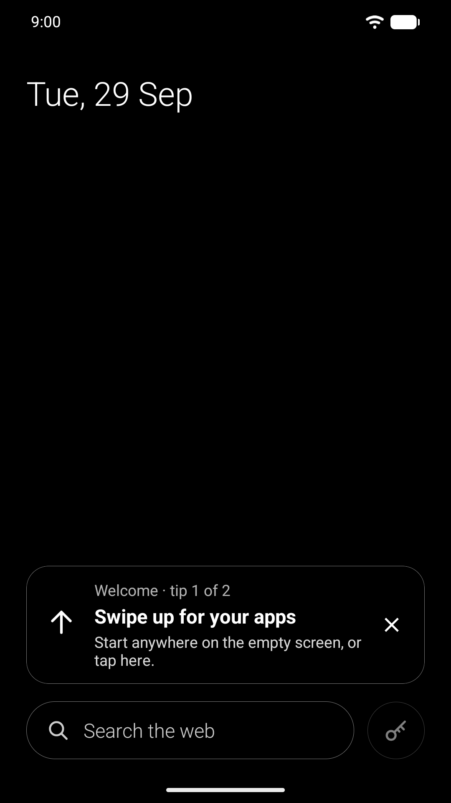
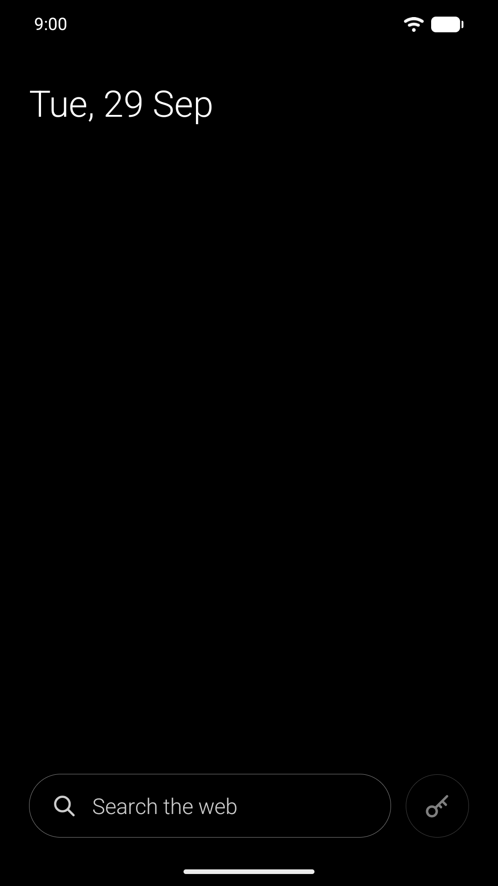
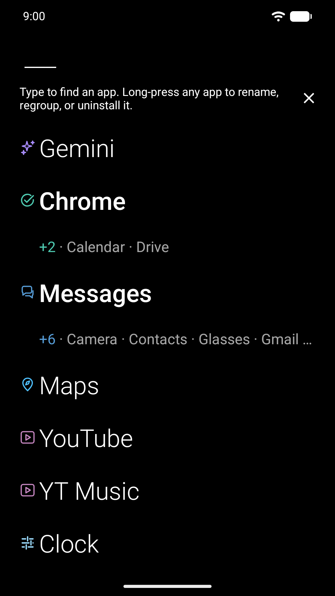
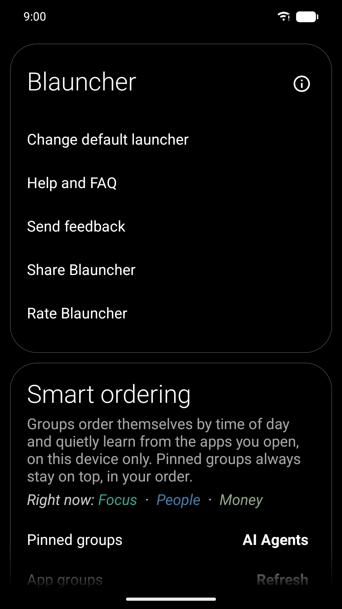

# Blauncher

A minimal, gesture-driven Android launcher that gets out of the way. The
home screen is a black screen with the date, a search bar, and a shortcut to
your password manager. No app icons, dock, or widgets. Everything else is a
gesture away.

**Swipe up** for your apps. **Long-press** for settings. That is the whole
interface. On first run a small tip card teaches those two gestures one at a
time and then gets out of the way; **Settings → How it works** has the rest
on one page, and the **[user guide](GUIDE.md)** covers everything.

## Screens

<p align="center">
  
  
  
  
</p>

<p align="center"><sub>First run &nbsp;·&nbsp; Home &nbsp;·&nbsp; App drawer &nbsp;·&nbsp; Settings</sub></p>

## What it does

- **A home screen with almost nothing on it.** The date up top; along the
  bottom, a search bar and a key glyph that opens your password manager. The
  search bar sends your query to the engine you choose (divid3 by default, or
  DuckDuckGo, Google, Bing, Brave, Kagi, Startpage, Ecosia, Perplexity,
  ChatGPT) in your default browser, or hands it to the browser's own engine.
  The key glyph finds an installed password manager (Bitwarden, 1Password,
  Proton Pass, KeePassDX, and others) on its own and can be pointed at any
  app. Swipe down for notifications, swipe left or right for two apps of your
  choice.
- **Type, don't hunt.** The keyboard opens with the drawer. Type a few
  letters: a single match launches itself, and Enter launches the first one.
  No match? Enter sends the text to the web. Prefix `!` for DuckDuckGo, or a
  leading space to browse without auto-launch.
- **Apps in groups, your picks on top.** Apps are sorted on-device into groups
  such as AI Agents, People, Focus, News, Media, and Tools, each with a small
  colored glyph. Long-press an app to change its groups, including several at
  once, or to **emphasize** it: emphasized apps go bold and rise to the top of
  their group while the rest fold into one faded line
  (`+5 · Gemini · Perplexity · …`) that expands on tap. Search still matches
  folded apps, so nothing is ever out of reach. Long-press a glyph to toggle
  emphasis in place.
- **An order that follows your day.** Groups shift with the time of day, news
  in the morning, focus during work, media in the evening, then sharpen from
  the apps you actually open. Apps stay alphabetical inside each group with
  emphasized ones first. Pin any groups to the top; AI Agents is pinned by
  default. Reset the learning any time in Settings.
- **Private by construction.** No internet permission, no usage-stats access,
  no accounts, sync, analytics, accessibility service, or launcher-managed
  wallpaper. What it learns lives in local preferences excluded from backups.
  It does not ask to see every installed app (`QUERY_ALL_PACKAGES`), only
  the launchable ones it lists. Private Space is supported with a
  tap-to-unlock row at the bottom of the drawer. Details in
  [`SECURITY.md`](SECURITY.md).
- **Phones, tablets, foldables and Chromebooks.** Phones stay in portrait;
  larger screens rotate freely and keep your place when they do. With a
  keyboard or mouse, the wheel, a letter key, the up arrow or Enter opens
  the drawer and right-click opens Settings. Back is predictive everywhere
  but Home, and TalkBack gets every gesture as an action.

## Latest Android, no compatibility code

Blauncher targets the latest public stable Android and the toolchain tracks
the latest Android Gradle Plugin and Gradle. It installs on Android 15 and
up, because that is the newest API the code uses (Private Space), not
because it carries code for older phones: there are no version checks.
Full policy in [`AGENTS.md`](AGENTS.md).

## Install

1. Download `Blauncher.apk` from the
   [latest release](https://github.com/bradflaugher/Blauncher/releases/tag/latest).
   Optionally verify it against `Blauncher.apk.sha256`
   (see [`SECURITY.md`](SECURITY.md)).
2. Install it, open it, and tap **Set as default launcher**.

Requires Android 15 or newer.

## Build

Toolchain versions are pinned in Gradle. Building needs JDK 24 or newer
(CI uses JDK 25) and an Android SDK with the platform and build tools named
in `app/build.gradle`.

```sh
./gradlew lint test assembleDebug   # what CI runs on every PR
./gradlew assembleRelease           # unsigned release APK
./gradlew bundleRelease             # unsigned release bundle (.aab) for Google Play
```

CI passes the version in through the environment:

```sh
BLAUNCHER_VERSION_CODE=42 BLAUNCHER_VERSION_NAME=1.0.42 ./gradlew assembleRelease
```

The application ID is `com.bradflaugher.blauncher`; the source namespace is
`app.olauncher`.

### Signed releases

Set all four variables or none. A partial configuration fails the build.

```sh
export BLAUNCHER_KEYSTORE_PATH=/absolute/path/to/blauncher.jks
export BLAUNCHER_STORE_PASSWORD=store-password
export BLAUNCHER_KEY_ALIAS=key-alias
export BLAUNCHER_KEY_PASSWORD=key-password
./gradlew assembleRelease
```

### CI

Every push to `main` runs lint and tests, builds a signed release, and
replaces the `latest` release with `Blauncher.apk`, `Blauncher.apk.sha256`,
`Blauncher.aab` (for Google Play), and `mapping.txt` (R8 deobfuscation for
Play crash reports). Pull requests run the same checks and build unsigned
artifacts without publishing. The version code is the workflow run number,
so it only goes up; renaming or recreating the workflow would reset it, and
Play rejects any upload whose version code is not higher than the last. CodeQL scans Kotlin and the workflows on every push and weekly.

Secrets: `BLAUNCHER_KEYSTORE_BASE64`, `BLAUNCHER_STORE_PASSWORD`,
`BLAUNCHER_KEY_ALIAS`, `BLAUNCHER_KEY_PASSWORD`.

## Google Play

The store listing (title, descriptions, icon, feature graphic, screenshots,
release notes) lives in `fastlane/metadata/android/en-US` in the layout
`fastlane supply` reads.

1. **Upload.** Take `Blauncher.aab` from the `latest` release and upload it
   to a testing track, with `mapping.txt` as its deobfuscation file (or
   `fastlane supply --aab Blauncher.aab --track internal`). Use Play App
   Signing; to keep Play and sideloaded installs updating each other, enrol
   the existing `BLAUNCHER_*` key as the app signing key and use a separate
   upload key.
2. **App content.**
   - Privacy policy: <https://bradflaugher.com/privacy/blauncher/> (also
     linked from Settings).
   - Data safety: no data collected or shared. The app has no `INTERNET`
     permission, backups and device transfer are disabled, and web searches
     are handed to another app by intent.
   - Ads: none. App access: no login; set Blauncher as the default home app
     to review it.
   - Target audience: not directed at children. Category: Personalization.
3. **Permissions.** `ACCESS_HIDDEN_PROFILES` shows and unlocks Private Space
   in the drawer (only granted to the default home app); expect a
   justification prompt and attach a short video of unlocking it.
   `REQUEST_DELETE_PACKAGES` backs the drawer's Uninstall action, which
   always goes through the system confirmation. `EXPAND_STATUS_BAR` backs
   the swipe-down-for-notifications gesture.
4. **Screenshots** must be 9:16 or 16:9 PNG or JPEG without alpha. Tablet
   screenshots must be real tablet captures. The ones in `images/` are
   captures of a debug build on the Android emulator (Pixel 8, Nexus 7 and
   Pixel Tablet images) on a fresh install, so the first-run tips show:
   - Size the screen to 9:16 first:
     `adb shell wm size 1080x1920 && adb shell wm density 420` for the
     phone, `1080x1920` at `280` for 7-inch, `1620x2880` at `320` for
     10-inch (swap the numbers for landscape).
   - Make Blauncher the home app
     (`adb shell cmd role add-role-holder android.app.role.HOME com.bradflaugher.blauncher.debug`),
     black out the wallpaper (`adb shell cmd wallpaper set-dim-amount 1`),
     and tidy the status bar with System UI demo mode.
   - Capture with `adb exec-out screencap -p > shot.png`, then drop the
     alpha channel (`magick shot.png -alpha off PNG24:shot.png`).

## Docs

- [`GUIDE.md`](GUIDE.md): gestures, screens, settings
- [`SECURITY.md`](SECURITY.md): reporting, release verification, privacy
- [`AGENTS.md`](AGENTS.md): contributor and agent instructions, latest-only policy

## License

GPL-3.0. See [`LICENSE`](LICENSE). Blauncher began as a fork of
[Olauncher](https://github.com/tanujnotes/Olauncher) by Tanuj Notes and is
released under the same terms.
